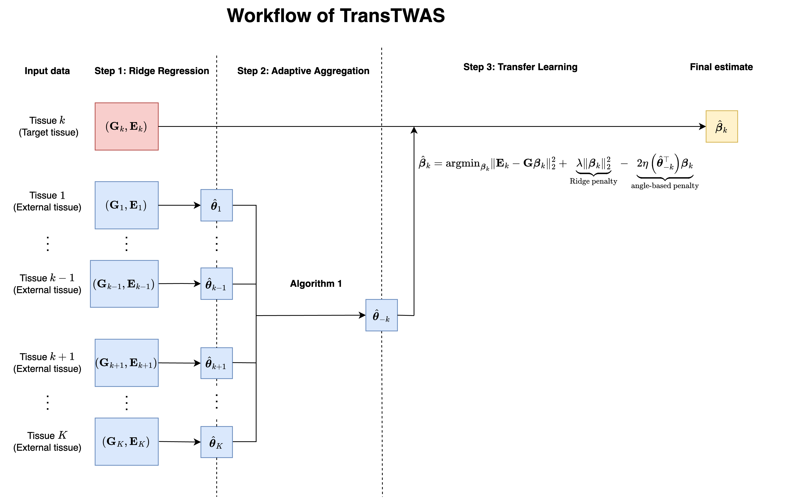

# TransTWAS

TRANSfer Learning into TWAS framework (TransTWAS).

## About

TransTWAS utilizes external tissues' information to predict cross-tissue gene expression through penalizing the angle between source estimate and target parameter. TransTWAS can adaptively aggregate multiple source estimates. The `R` package `Rcpp` was used to speed up the calculation. The workflow of TransTWAS is shown in the following diagram.



## Tutorial

We note that the `R` package `bigsnpr` was used to prepare for the genotype matrix. Users are recommended to go through [the tutorial](https://privefl.github.io/bigsnpr/) before implementation.

## Install the necessary packages

The following code will automatically detect and install the necessary packages if not installed before.

```         
list.of.packages <- c(
  "foreach",
  "doParallel",
  "dplyr",
  "tidyr",
  "tidyverse",
  "data.table",
  "glmnet",
  "stringr",
  "MASS", 
  "stats",
  "bigsnpr",
  "RcppArmadillo",
  "Rcpp",
  "Matrix"
)

new.packages <- list.of.packages[!(list.of.packages %in% installed.packages()[,"Package"])]

if(length(new.packages) > 0){
  install.packages(new.packages, dep=TRUE)
}

#loading packages
for(package.i in list.of.packages){
  suppressPackageStartupMessages(
    library(
      package.i, 
      character.only = TRUE
      )
    )
}
```

## Input files and formats

The user can input data to `TransTWAS()` through specifying the directory of the files. We note that user should not add extra "/" in the end of directory. For example, `dir_exp=.../ENSG12341234123` instead of `dir_exp=.../ENSG12341234123/`. 

-   Genotype matrix: the genotype matrix with each row being an observation and each column being the genotype. It should be loaded from the backing files prepared by `bigsnpr`. The function `TransTWAS_output` will ask the user to specify the directory to the corresponding `.rds` file. e.g., `.../geno_bigsnpr/ENSG12341234123.rds"`. The `.rds` (and the associated `.bk` file) should be prepared following the instruction of `bigsnpr`. No column name and row name should be assigned prior to TransTWAS's processing.

```
x    [,1] [,2] [,3] [,4] [,5] [,6] [,7] [,8]
[1,]    0    1    0    0    0    1    0    0
[2,]    0    0    0    0    0    0    0    0
[3,]    0    1    0    0    0    1    0    0
[4,]    0    1    0    0    0    1    0    0
[5,]    0    0    0    0    0    0    0    0
[6,]    1    1    1    1    1    1    0    0
[7,]    0    1    0    0    0    1    0    0
[8,]    0    1    0    0    0    1    0    0
```

-   Response file (e.g., `/expression/ENSG12341234123/Y_Brain_Frontal_Cortex.txt`): each sub-folder of the `expression` folder contains the gene expression of each protein-coding gene (e.g., `ENSG12341234123`). The expression of that gene in tissue `XX_YY_ZZ` will be named as `Y_XX_YY_ZZ.txt` (e.g., `Y_Brain_Frontal_Cortex.txt`). The inputdataframe should contain two columns, the first the identifier of the individual, the second column will be the gene expression. A sample header is as follows:

```         
"GTEX-1117F" 0.347138342448021
"GTEX-111CU" 0.0266373744838111
"GTEX-111FC" -0.228407778682672
"GTEX-111VG" -0.192275001311951
"GTEX-111YS" 0.193126574882358
```

* Following the practice of [UTMOST](https://www.nature.com/articles/s41588-019-0345-7), TransTWAS will automatically center but not standardize the genotype matrix, and center the gene expression.

## Usage

```         
TransTWAS(fold = 5, 
          n_tune = 5, 
          n_cores=48,
          gene_name="ENSG00000169174.10",
          dir_geno=".../ENSG00000169174.10.rds",
          dir_exp=".../ENSG00000169174.10",
          dir_output=".../output",
          tar_tis_name="Liver")
```

-   `fold`: `integer`. Number of folds for cross-validation.
-   `n_tune`: `integer`. Number of candidate tuning parameters for `lambda` and `eta`.
-   `cores`: `integer`. Number of cores to be used for parallel computing. If `cores` is larger or equal to 2, parallel computing is enforced.
-   `gene_name`: `character`. Name of the gene under investigation.
-   `dir_geno`: `character`. Directory to the genotype matrix. Note that it is the backing file generated by `bigsnpr`. For example, `dir_geno=".../ENSG12341234123.rds"`
-   `dir_exp`: `character`. Directory to the expression vector. Note that the directory point to the folder that contains `gene_name`'s expression. For example, if `gene_name=ENSG12341234123`, then `dir_exp=.../ENSG12341234123` instead of `.../ENSG12341234123/Y_Brain_Frontal_Cortex.txt`.
-   `tar_tis_name`: `character`. Name of target tissue. Note that after specifying the target tissue name, `TransTWAS` will automatically use the other tissues in `dir_exp` as the source tissues.
* `dir_output`: `character`. The directory to store the output.

## Output file

The function will return two files:

-   `gene_name.rds`: imputed weights.
-   `GReX_gene_name.rds`: the GReX.

## Simulation

The code for simulation in the manuscript is also attached: 

* `type1_err.R`
* `power_and_exp_pred.R`
* `step_1_simu.R`

## Contact

For any issues regarding TransTWAS, please contact <dylai@connect.hku.hk>.
